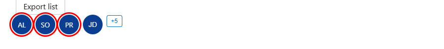
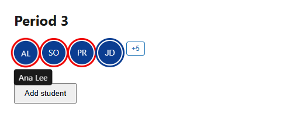
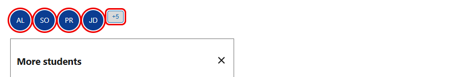
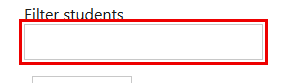
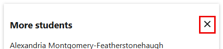
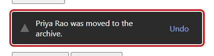
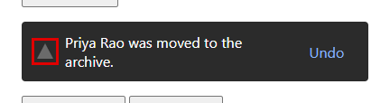
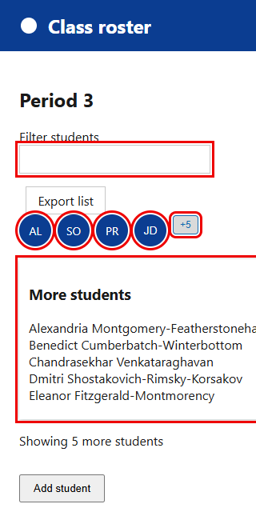
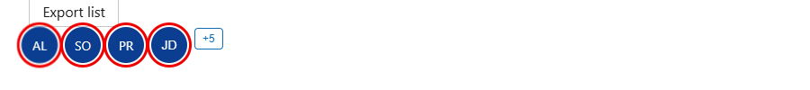

# Accessibility audit: Class roster (`audit_fixture/index.html`)

## Summary

- **Scope:** `index.html`, its dropdown and its snackbars. Out of scope: nothing else.
- **Verdict:** No Blockers. Keyboard users can't reach the student bubbles, and a contrast failure and an unnamed button make the overflow dropdown hard to use.
- **Findings:** Blocker 0, Critical 5, Moderate 5, Minor 0. 5 best practices. 1 more needs verification.
- **Checks:** axe, keyboard, hover, 320px reflow and contrast run; no screen reader.
- **Fix first:**
  1. Make the initials bubbles keyboard-reachable and named (#1)
  2. Fix the "+5" hover and open contrast (#3)
  3. Name the close button (#5)

## Findings

### Element: Tooltip on the initials bubbles (AL, SO, PR)

Three initials-only bubbles that show the full name in a tooltip on hover. 3 instances.

#### 1. Critical · 2.1.1 · 3 instances · High confidence · Bubbles can't be reached by keyboard, so their names are unavailable

- **Summary:** The initials bubbles aren't focusable, so keyboard and screen reader users can never reach them or the names behind them. See also #2 (the tooltip's hover behavior, 1.4.13).
- **Why this severity:** Keyboard-inoperable content is Critical at minimum (calibration A). Here the full names exist only in the hover tooltip, so a keyboard user has no way to learn who a bubble is.
- **Screenshot:** 
  Text evidence: the first Tab stop is `#jd`; the three bubbles have `tabIndex = -1` and no role.
- **Suggested fix:** Make each bubble a named, focusable element, for example `<button type="button" class="bubble" aria-label="AL, Ana Lee">AL</button>`.
- **Evidence:**
  - **WCAG SC:** 2.1.1 Keyboard
  - **Status:** pre-existing
  - **Repro steps:**
    1. Open `index.html` in Edge at 1280px.
    2. Press Tab from the page start.
    3. Observe focus land on JD, then +5, never on AL, SO or PR.
  - **Observed:** The bubbles have `tabIndex = -1`, no role and no name in the accessibility tree.
  - **Expected:** Everything a mouse user can reach can be reached by keyboard (2.1.1).
  - **Relevant elements:** `.roster li:nth-child(-n+3) .bubble` (AL, SO, PR)
  - **Confidence:** High. Reproduced in Edge by keyboard and confirmed in the accessibility tree.
  - **Source:** browser check

#### 2. Moderate · 1.4.13 · 3 instances · High confidence · Tooltip can't be dismissed and vanishes when hovered

- **Summary:** The tooltip closes if the pointer moves onto it and can't be dismissed with Escape. See also #1 (keyboard access, 2.1.1).
- **Why this severity:** Mouse and screen-magnifier users lose the name while trying to read it. The names are available in the dropdown, so the task survives.
- **Screenshot:** 
  Text evidence: pressing Escape with the tooltip showing does not close it; moving onto the tip hides it.
- **Suggested fix:** Keep the tooltip open while the pointer is on the bubble or the tip (remove the 0.5rem gap), and close it on Escape.
- **Evidence:**
  - **WCAG SC:** 1.4.13 Content on Hover or Focus
  - **Status:** pre-existing
  - **Repro steps:**
    1. Hover the "AL" bubble: a tooltip appears.
    2. Press Escape: it stays.
    3. Move the pointer down to the tooltip: it disappears.
  - **Observed:** No Escape handling; a gap between the bubble and the tip hides it.
  - **Expected:** Dismissible, hoverable and persistent (1.4.13).
  - **Relevant elements:** `.bubble:hover .tip` for AL, SO and PR
  - **Confidence:** High. Reproduced in Edge with a mouse.
  - **Source:** browser check

### Element: "+5" button

The "+5" overflow button. 1 instance.

#### 3. Critical · 1.4.3 · 1 instances · High confidence · Hover and open state fails text contrast

- **Summary:** Blue #146eb3 text on the grey #d9dada hover fill is 3.83:1 for 12px text, below the 4.5:1 needed.
- **Why this severity:** Contrast failures are Critical in any state (calibration A). Low-vision users can't reliably read the label while it is hovered or open.
- **Screenshot:** 
  Text evidence: axe `color-contrast` (serious): 3.83 (foreground #146eb3, background #d9dada, 12px).
- **Suggested fix:** Use a darker hover and open fill (for example white text on #146eb3) or a darker text color.
- **Evidence:**
  - **WCAG SC:** 1.4.3 Contrast (Minimum)
  - **Status:** pre-existing
  - **Repro steps:**
    1. Open `index.html` and click "+5" to open the dropdown.
    2. Run axe-core, or measure the button's colors.
  - **Observed:** axe reports 3.83:1 on `#more[aria-expanded=true]`.
  - **Expected:** At least 4.5:1 for normal text (1.4.3).
  - **Relevant elements:** `#more` in `:hover` and `[aria-expanded="true"]` states
  - **Confidence:** High. Computed from the rendered colors and confirmed by axe.
  - **Source:** axe `color-contrast` (serious), contrast calculation

### Element: Filter students text input

The text input above the roster. 1 instance.

#### 4. Critical · 1.4.11 · 1 instances · High confidence · Input's only visual boundary is a 1.7:1 border

- **Summary:** The input has no fill, label background or icon: its 1px #c8c8c8 border is the only thing showing where it is, and it is 1.67:1 on white (needs 3:1).
- **Why this severity:** The border is the only cue that identifies the control, so a non-text contrast failure is Critical (calibration A). Low-vision users can't see where to type.
- **Screenshot:** 
  Text evidence: border #c8c8c8 on #ffffff = 1.67:1, computed from the rendered colors.
- **Suggested fix:** Darken the border to at least 3:1, for example `#767676` (4.5:1).
- **Evidence:**
  - **WCAG SC:** 1.4.11 Non-text Contrast
  - **Status:** pre-existing
  - **Repro steps:**
    1. Open `index.html`.
    2. Read the computed border color and the background of `#filter`.
    3. Compute the contrast ratio.
  - **Observed:** Border rgb(200,200,200) on rgb(255,255,255): 1.67:1. There is no other visual cue for the input.
  - **Expected:** At least 3:1 for the visual information required to identify a control (1.4.11).
  - **Relevant elements:** `#filter` (`.field`)
  - **Confidence:** High. Computed numeric failure. The input has nothing else that identifies it.
  - **Source:** contrast calculation

### Element: Close button

The icon-only close button in the dropdown. 1 instance.

#### 5. Critical · 4.1.2 · 1 instances · High confidence · Icon-only close button has no accessible name

- **Summary:** The close button contains only an `aria-hidden` icon, so a screen reader announces "button" with no purpose.
- **Why this severity:** An unnamed control that receives focus is Critical (calibration A): opening the dropdown moves focus onto it, and a screen reader user must guess what it does.
- **Screenshot:** 
  Text evidence: axe `button-name` (critical) on `#close`.
- **Suggested fix:** Add `aria-label="Close"`.
- **Evidence:**
  - **WCAG SC:** 4.1.2 Name, Role, Value
  - **Status:** pre-existing
  - **Repro steps:**
    1. Open `index.html`, click "+5".
    2. Read the accessibility name of the button that takes focus, or run axe.
  - **Observed:** No accessible name; axe `button-name`.
  - **Expected:** Every button has an accessible name (4.1.2).
  - **Relevant elements:** `#close`
  - **Confidence:** High. Flagged by axe and confirmed in the accessibility tree.
  - **Source:** axe `button-name` (critical)

### Element: Snackbar after "Archive Priya"

A message with a warning icon and an Undo button that appears after "Archive Priya". 1 instance.

#### 6. Critical · 1.4.11 · 1 instances · High confidence · Warning icon is 2.66:1 against the snackbar

- **Summary:** The icon, #6b6b6b on the #2b2b2b snackbar, is 2.66:1, below 3:1. See also #8.
- **Why this severity:** The icon is the only cue to the message type, so it is a required cue and Critical (calibration A). Any other 1.4.11 failure would be Moderate at minimum.
- **Screenshot:** 
  Text evidence: computed colors #6b6b6b on #2b2b2b, 2.657:1.
- **Suggested fix:** Use an icon color of at least 3:1 against #2b2b2b, for example #f0b429.
- **Evidence:**
  - **WCAG SC:** 1.4.11 Non-text Contrast
  - **Status:** pre-existing
  - **Repro steps:**
    1. Click "Archive Priya".
    2. Read the icon's fill and the snackbar's background from the computed styles.
  - **Observed:** 2.657:1.
  - **Expected:** At least 3:1 for a graphic needed to understand the content (1.4.11).
  - **Relevant elements:** `.snackbar svg path`
  - **Confidence:** High. Calculated from the stylesheet.
  - **Source:** contrast calculation

#### 7. Moderate · 2.2.1 · 1 instances · High confidence · Actionable message disappears after 5 seconds and can't be re-opened

- **Summary:** The snackbar removes itself after 5 seconds (`setTimeout(..., 5000)`), including its Undo action. There is no way to turn the limit off, extend it, or bring the message back. See also #6 and #8 (the same snackbar's icon).
- **Why this severity:** By impact (no confirmed anchor). The message carries an action, so a keyboard or screen reader user who needs longer than 5 seconds to reach Undo loses it.
- **Screenshot:** 
  Text evidence: the script removes the element after 5000ms; there is no inbox or history.
- **Suggested fix:** Don't auto-dismiss actionable or important messages: keep this one until the user dismisses it or acts. Let users re-open dismissed messages (for example a notifications inbox or history). Pausing the timer on hover and focus helps too, but isn't enough alone, because a user may not get the pointer or focus into the message within 5 seconds.
- **Evidence:**
  - **WCAG SC:** 2.2.1 Timing Adjustable
  - **Status:** pre-existing
  - **Repro steps:**
    1. Open `index.html` and click "Archive Priya".
    2. Wait 5 seconds.
  - **Observed:** The snackbar and its Undo button are removed. Nothing records that it appeared.
  - **Expected:** The user can turn off, adjust or extend the limit, or an alternative that doesn't depend on the timer exists (2.2.1).
  - **Relevant elements:** `.snackbar` created by `#archive`
  - **Confidence:** High. Reproduced in Edge; the timer is in the page script.
  - **Source:** browser check and the live-region probe

#### 8. Moderate · 1.1.1 · 1 instances · High confidence · Warning icon is hidden, and the text doesn't say it is a warning

- **Summary:** The triangle icon is `aria-hidden`, but it is the only thing that says this is a warning. The text, "Priya Rao was moved to the archive.", doesn't state the type. See also #6 and #7.
- **Why this severity:** By impact (no confirmed anchor). A screen reader user doesn't learn the type of the message. Not Minor, because the type is information.
- **Screenshot:** 
  Text evidence: accessibility tree: the snackbar reads "Priya Rao was moved to the archive. Undo" with no mention of a warning.
- **Suggested fix:** Give the icon a text alternative ("Warning") or start the text with the type ("Warning: ..."). Keep the icon hidden only when the text states the type.
- **Evidence:**
  - **WCAG SC:** 1.1.1 Non-text Content
  - **Status:** pre-existing
  - **Repro steps:**
    1. Click "Archive Priya".
    2. Read the snackbar in the accessibility tree.
  - **Observed:** `<svg aria-hidden="true">` carries the warning; the text doesn't.
  - **Expected:** Non-text content that conveys information has a text alternative serving the equivalent purpose (1.1.1).
  - **Relevant elements:** `.snackbar svg`
  - **Confidence:** High. Confirmed in the accessibility tree.
  - **Source:** accessibility tree

### Element: Student dropdown

The panel opened by "+5". 1 instance.

#### 9. Moderate · 1.4.10 · 1 instances · High confidence · Dropdown overflows at 320px

- **Summary:** The dropdown is a fixed 26rem wide and long names don't wrap, so the page scrolls sideways at 320px.
- **Why this severity:** Reflow failures are Moderate (calibration A). Users who zoom to 400% scroll in two directions but can still read everything.
- **Screenshot:** 
  Text evidence: `document.documentElement.scrollWidth` is 464 at a 320px viewport.
- **Suggested fix:** Replace the fixed width with `max-width: 100%` and let names wrap (`white-space: normal; overflow-wrap: anywhere`).
- **Evidence:**
  - **WCAG SC:** 1.4.10 Reflow
  - **Status:** pre-existing
  - **Repro steps:**
    1. Open `index.html` and click "+5".
    2. Resize the viewport to 320 CSS px wide.
  - **Observed:** Horizontal scrolling; names are clipped.
  - **Expected:** No two-dimensional scrolling at 320 CSS px (1.4.10).
  - **Relevant elements:** `#dd.dropdown`, `.dropdown li` (white-space: nowrap)
  - **Confidence:** High. Measured in the browser at 320px.
  - **Source:** browser check

### Element: Clickable "JD" bubble

The one clickable initials bubble. 1 instance.

#### 10. Moderate · 2.5.3 · 1 instances · Medium confidence · Accessible name doesn't contain the visible label

- **Summary:** The bubble shows "JD" but is named "John Doe", so a voice-control user saying "click JD" doesn't activate it.
- **Why this severity:** Label in Name mismatches are Moderate (calibration A). Voice-control users can still say the full name or use a numbered overlay.
- **Screenshot:** 
  Text evidence: accessibility tree: `button "John Doe": JD`.
- **Suggested fix:** Set `aria-label="JD, John Doe"`.
- **Evidence:**
  - **WCAG SC:** 2.5.3 Label in Name
  - **Status:** pre-existing
  - **Repro steps:**
    1. Open `index.html`.
    2. Read the accessibility tree for the "JD" button.
  - **Observed:** Name "John Doe", visible text "JD".
  - **Expected:** The accessible name starts with the visible label (2.5.3).
  - **Relevant elements:** `#jd`
  - **Confidence:** Medium. Clear from the accessibility tree; not tested with a voice-control product.
  - **Source:** browser check

## Minor issues

None.

## Best practices

| # | Element | What | Suggested fix | Confidence |
|---|---|---|---|---|
| 11 | Initials bubbles | No prefers-reduced-motion block for the hover scale | Wrap the `transform` transition in `@media (prefers-reduced-motion: no-preference)`. | High |
| 12 | Export list button | Its 1.7:1 border is not required to contrast, because the 17:1 text identifies the button | Optionally darken the border to 3:1 or more so every control is clearly delineated. | High |
| 13 | Snackbar after "Archive Priya" | An Undo button inside the live region: its role isn't announced and users may not reach it before the timer ends (the timer itself is #7) | Show Undo next to the archived row or in a history list, and keep the toast text-only. | Medium |
| 14 | More students dropdown | Named section that already has a heading: the panel has `aria-labelledby` and a visible `h3`, so the name is announced twice | Remove `aria-labelledby` and keep the heading. | Medium |
| 15 | "Mute alerts" button | Its inner text changes to "Unmute alerts" to show state; some screen readers don't announce a text change on a focused button | Keep the text fixed and use `aria-pressed`. | Medium |

## Needs verification

| # | Element | WCAG SC | Suspected severity | Why suspected | Check that would confirm it |
|---|---|---|---|---|---|
| 16 | Announcer after "Add student" | 4.1.3 | Minor | The probe reports a transient message: "Student added to the roster" is put into a hidden `aria-live` announcer and removed after about 110ms. The region existed before and is exposed. | Test with NVDA and VoiceOver whether the message is spoken. |

## Passed / not an issue

- The header icon is `aria-hidden` and decorative: correct.
- The snackbars are added to a `role="status"` region that exists from page load: correct for 4.1.3.
- The "Save roster" snackbar has no timer, says "Success:" in text, so its hidden check icon is decorative, and its Dismiss button is named: correct.
- The "Add student" button is a native `<button>` whose name matches its label: correct.
- The "marking period" line runs past the edge at 320px, but it is one line, so no one scrolls back-and-forth to read it. Not a 1.4.10 failure.
- The dropdown's edge is a soft shadow only. A panel edge isn't required to contrast (1.4.11), so it is not logged.

## Needs manual testing

- Screen reader announcement of the status message (#16).
- Voice control on the "JD" bubble (#10).

## Out of scope

- Anything outside `index.html`.
